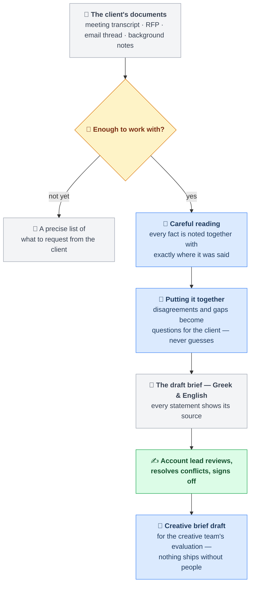

# Brief Builder

**From a messy pile of client inputs to a client-ready brief — in two languages, with receipts.**

## About this project

Every project starts as a pile of inputs — a kickoff transcript, an RFP, an email thread. An
account lead spends hours turning it into *the brief*, and the same things always go wrong:
a number misremembered, a contradiction missed, a gap filled with a guess.

**Brief Builder** reads those documents and drafts the brief in **Greek and English**, with a
citation on every statement pointing to the exact line that supports it. Where sources
disagree, it shows both quotes and asks. Where something is missing, it writes the question
to send the client. Three rules run through everything:

- 🧾 **Every claim carries a receipt** — no citation, no claim.
- 🙋 **Gaps become questions, never guesses** — "around eighty" stays that way until the
  client says eighty *what*.
- ✍️ **People decide** — nothing moves past the draft without an account lead's sign-off.

Built as a working demo for the ATCOM assignment: it runs end-to-end on a realistic synthetic
project with deliberately seeded traps, graded by a frozen exam it cannot see. Score:
**17/17**, at **~$2–2.6 per brief** against ~€38–40 of account-lead time.

## How it works



**The colors are the architecture:** 🟦 AI reads and drafts · 🟨 plain code checks ·
🟩 people decide. Every blue step is verified by an amber check — citations must resolve
word-for-word, protected brand terms must survive, no figure may appear that no source stated.
An output that fails is sent back once to fix; if it still fails, the system stops and says so.
**AI writes, code checks, humans decide.**

---

## For the technical reader

Two views of the same system. Both are true; they answer different questions.

### Product view (what Northlight gets — the deck's Slide 3)

```
Brief/
├── Input/          ← drop the project's source files here (transcript, RFP, emails, background)
├── Output/         ← draft brief (EL + EN renders) + open questions + conflicts, per run
├── SOURCES.md      ← extraction rules per source type
├── SYNTHESIS.md    ← cross-source assembly & canonicalization rules
├── TRANSLATION.md  ← bilingual render rules
└── TRANSCRIPTS.md  ← transcript fidelity rules
```

A folder, an input, an output, and four instruction files. The skeleton is the product.

### Build view (this repo — the factory and the exam)

| Path | Role | Ships to client? |
|---|---|---|
| `skills/*.md` (×4) | The four runtime instruction files (product) | Yes |
| `schema/`, `templates/`, `glossary/` | The executable form the 4 files depend on (product) | Yes |
| `config/` | Agency policy the gates read — `readiness_policy.json` (readiness thresholds) · `channel_specs.json` (deterministic channel spec table, DR-7) · `model_routing.json` (per-stage inference-depth policy) (product) | Yes |
| `pipeline/` | Deterministic gates + runner — "the steps that ensure quality" (product) | Yes |
| `fixtures/` incl. `answer_key.json` | Synthetic exam project with seeded conflicts/gaps/garbling | **No — test apparatus** |
| `eval/harness.py` | Frozen grader — scores a run against the answer key | **No — test apparatus** |
| `eval/repair_analysis.py`, `eval/cost_report.py`, `eval/substrate_spike.py` | Dev tooling over run manifests (recurring-violation, cost and substrate analysis); never read the answer key | No — engineering |
| `docs/COST_MODEL.md` | Per-brief cost re-derived from measured runs | No — engineering docs |
| `CLAUDE.md`, `docs/PRD.md`, `docs/TIERS.md` | Build governance for the autonomous run | No — engineering docs |
| `.claude/agents/` | Execution substrate on the Max subscription; in production these become metered API calls — same skeleton, deployment decision | Substrate-dependent |

Demo naming: `fixtures/northlight_01/` plays the role of `Input/`; `runs/<timestamp>/` plays the role of `Output/`.

### Run it

```bash
pip install -r requirements.txt        # jsonschema, pytest, PyYAML — nothing else
python -m pytest -q                    # 280 tests, no model calls, no cost, ~0.3s

# The model stages run as Claude Code subagents: install the `claude` CLI and be
# authenticated. A full Stage-1 run makes 6 model calls (~$2–2.6 measured; docs/COST_MODEL.md).
python pipeline/runner.py --project fixtures/northlight_01   # full Stage-1 run → runs/<ts>/
python eval/harness.py runs/latest                           # grade it against the answer key
python eval/cost_report.py                                   # what your runs actually cost
python eval/cost_report.py runs/<ts> --tokens                # where the tokens go, per stage
```

No CLI, no API budget? The graded run is committed as an evidence pack at **`runs/tier3/`** —
the signed `brief.json`, both renders, all four extracts, the fidelity report, the harness
verdict (`harness_report.json`, 17/17), and both shadow creative drafts. Every claim in the
tier reports is inspectable there without running anything.

### Two stages, one gate between them

Stage 1 (client brief) is the default flow: `python pipeline/runner.py --project <folder>` runs
readiness → classify → fidelity → extract → conflict pass → synthesize → render. Stage 2 (creative
brief) is **shadow mode** and never runs automatically — it needs a human to set
`signoff.status = "signed_off"` on the brief first (DR-8), then `--stage creative` runs
`creative-shadow` (its channel specs come only from `config/channel_specs.json`, never generated).
The sign-off gate between the stages is topology, not policy: `creative-shadow` refuses any brief
that is not signed off.
