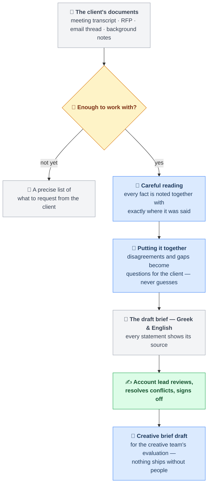

# Brief Builder

**From a messy pile of client inputs to a client-ready brief — in two languages, with receipts.**

> **Just cloned?** Open **[START_HERE.html](START_HERE.html)** in your browser first — the
> visual front door: a finished brief, the pipeline walkthrough, and the five-minute run
> guide, all offline from this repo. (GitHub shows this file as source; your browser renders it.)

## About this project

Every project starts as a pile of inputs — a kickoff transcript, an RFP, an email thread. An
account lead spends hours turning it into *the brief*, and the same things always go wrong:
a number misremembered, a contradiction missed, a gap filled with a guess.

**Brief Builder** reads those documents and drafts the brief in **Greek and English**, with a
citation on every statement pointing to the exact line that supports it. Where sources
disagree, it shows both quotes and asks. Where something is missing, it writes the question
to send the client. Three rules run through everything:

- 🧾 **Every claim carries a receipt** — no citation, no claim.
- 🙋 **Gaps become questions, never guesses** — "around eighty" stays that way until the
  client says eighty *what*.
- ✍️ **People decide** — nothing moves past the draft without an account lead's sign-off.

Built as a working demo for a hiring case study: it runs end-to-end on a realistic synthetic
project with deliberately seeded traps, graded against a sealed answer key it cannot see. Score:
**17/17**, at **~$2–2.6 per brief** against ~€38–40 of account-lead time.
Full artifact-backed proof — what ran, every check, every trap caught: **[docs/EVIDENCE.md](docs/EVIDENCE.md)**.

## How it works



**The colors are the architecture:** 🟦 AI reads and drafts · 🟨 plain code checks ·
🟩 people decide. Every blue step is verified by an amber check — citations must resolve
word-for-word, protected brand terms must survive, no figure may appear that no source stated.
An output that fails is sent back once to fix; if it still fails, the system stops and says so.
**AI writes, code checks, humans decide.**

---

## For the technical reader

Two views of the same system. Both are true; they answer different questions.

### Product view (what Northlight gets — the deck's Slide 3)

```
Brief/
├── Input/          ← drop the project's source files here (transcript, RFP, emails, background)
├── Output/         ← draft brief (EL + EN renders) + open questions + conflicts, per run
├── SOURCES.md      ← extraction rules per source type
├── SYNTHESIS.md    ← cross-source assembly & canonicalization rules
├── TRANSLATION.md  ← bilingual render rules
└── TRANSCRIPTS.md  ← transcript fidelity rules
```

A folder, an input, an output, and four instruction files. The skeleton is the product.

### Build view (this repo — the factory and the exam)

| Path | Role | Ships? |
|---|---|---|
| `skills/*.md` (×4) | The four runtime instruction files — the product itself | Yes |
| `schema/` · `templates/` · `glossary/` | The contracts those files execute against | Yes |
| `config/` | Agency policy as data: readiness thresholds, channel spec table, per-stage effort | Yes |
| `pipeline/` | The deterministic core — runner, gates, repair loop | Yes |
| `fixtures/` (+ `answer_key.json`) | The exam: a synthetic project with seeded conflicts, gaps and garbling | **No — test apparatus** |
| `eval/harness.py` | The grader — file unchanged since its Tier-1 freeze; criteria fixed; sole reader of the sealed answer key¹ | **No — test apparatus** |
| `eval/` (rest) | Dev tooling over run manifests: recurring violations, cost, substrate | No |
| `docs/` · `CLAUDE.md` | Build governance and the engineering record (PRD, tiers, cost model) | No |
| `.claude/agents/` | Demo substrate (Claude Code subagents); production swaps in metered API calls — same skeleton | Depends |

Demo naming: `fixtures/northlight_01/` plays `Input/`; `runs/<timestamp>/` plays `Output/`.

¹ Precision matters here: the harness *file* has one commit in its history and the answer key
has one; but one function the harness imports (`gates.verify_citations`) changed once, at
Tier 3 (`81e201c`), to fix a demonstrated false positive — human-approved, documented in
`runs/tier_3_report.md` §4, with fabrication detection re-proven. The criteria and the answer
key never moved; the shared implementation did, once, in the open.

### Run it

```bash
python3 -m venv .venv && source .venv/bin/activate   # system pip is locked on modern macOS
python3 -m pip install -r requirements.txt           # jsonschema, pytest, PyYAML — nothing else
python3 -m pytest -q                                 # 321 tests, no model calls, ~0.4s

# Model stages run as Claude Code subagents (install + authenticate the `claude` CLI).
# A full Stage-1 run makes 6 model calls — ~$2–2.6 measured (docs/COST_MODEL.md).
python3 pipeline/runner.py --project fixtures/northlight_01   # full run → runs/<ts>/
python3 eval/harness.py runs/latest                           # grade against the answer key
python3 eval/cost_report.py                                   # measured cost per run
python3 eval/cost_report.py runs/<ts> --tokens                # where the tokens go, per stage
```

**Live demo** — one document in, verified facts out (classify → extract → gates, no synthesis):
`python3 demo/run_demo.py fixtures/northlight_01/transcript_kickoff.md` (or pipe any ≤800-word
text via `-`). Prints the facts table with exact quotes, gate results, and the open questions
it creates instead of guessing. Timing: [docs/demo_timing.md](docs/demo_timing.md).

No CLI or budget? The graded run is committed at **`runs/tier3/`** — signed brief, both
renders, all extracts, fidelity report, harness verdict (17/17), both shadow creative drafts.
Every claim in the tier reports is inspectable there without running anything.

### Two stages, one gate between them

Stage 1 (the client brief) is the default flow: readiness → classify → fidelity → extract →
conflict pass → synthesize → render. Stage 2 (the creative brief) never runs automatically:
a human must set `signoff.status = "signed_off"` first, then `--stage creative` — and its
channel specs come only from `config/channel_specs.json`, never generated. The gate between
the stages is topology, not policy: `creative-shadow` refuses an unsigned brief.
