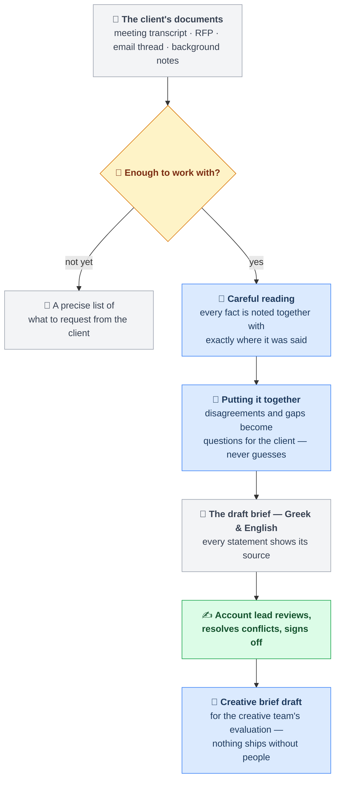

# Brief Builder

**From a messy pile of client inputs to a client-ready brief — in two languages, with receipts.**

## About this project

Every agency project starts the same way: a kickoff call, an RFP, a thread of emails, some
background documents. Someone — usually an account lead, usually late — has to turn that pile
into *the brief*: the single document everyone downstream works from. It takes hours, and the
things that go wrong are always the same ones: a number gets "remembered" slightly wrong, two
sources disagree and nobody notices, a gap gets papered over with a plausible guess.

**Brief Builder** is an AI-assisted pipeline that does the reading and the drafting — and is
deliberately built *not* to do the guessing. It reads the client's documents, drafts the brief
in **Greek and English** from one shared source of truth, and attaches a citation to every
single statement, pointing back to the exact moment in the transcript or the exact section of
the RFP that supports it. When sources disagree (the RFP says one audience, the CMO said
another), it doesn't pick a winner — it puts the disagreement in front of a human, with both
quotes. When something is missing, it writes the question you should ask the client, ready to
send.

Three principles run through everything:

- 🧾 **Every claim carries a receipt.** No citation, no claim — checked by code, not by trust.
- 🙋 **Gaps become questions, never guesses.** "Around eighty" stays "around eighty" until the
  client says eighty *what*.
- ✍️ **People make every decision that matters.** Nothing advances past the draft without an
  account lead's sign-off, and nothing the system produces ships to a client on its own.

The project is a working demonstration built for the ATCOM assignment: it runs end-to-end on a
realistic synthetic project (a Greek beverage brand's summer campaign — with contradictions,
gaps and garbled transcript audio seeded on purpose), and it is graded by a frozen, automated
exam it cannot see. Current score: **17/17**, at a measured cost of **about $2–2.6 per brief**
against roughly €38–40 of account-lead time.

## How it works



**How to read the colors — this is also the architecture:**
🟦 *blue* is AI at work (reading, assembling, drafting) · 🟨 *amber* is an automatic check
written in plain code (no AI involved — the same input always gives the same verdict) ·
🟩 *green* is a person deciding. In fact every blue step has an amber check behind it: each
AI output is inspected by code — citations must resolve word-for-word in the source, protected
brand terms must survive untouched, no currency or total may appear that no source stated —
and an output that fails its check is sent back once, with the exact list of problems, to fix.
If it can't, the system stops and says so rather than passing along something unverified.
That division of labor is the whole design: **AI does the reading and writing, deterministic
code does the checking, humans do the deciding.**

---

## For the technical reader

Two views of the same system. Both are true; they answer different questions.

### Product view (what Northlight gets — the deck's Slide 3)

```
Brief/
├── Input/          ← drop the project's source files here (transcript, RFP, emails, background)
├── Output/         ← draft brief (EL + EN renders) + open questions + conflicts, per run
├── SOURCES.md      ← extraction rules per source type
├── SYNTHESIS.md    ← cross-source assembly & canonicalization rules
├── TRANSLATION.md  ← bilingual render rules
└── TRANSCRIPTS.md  ← transcript fidelity rules
```

A folder, an input, an output, and four instruction files. The skeleton is the product.

### Build view (this repo — the factory and the exam)

| Path | Role | Ships to client? |
|---|---|---|
| `skills/*.md` (×4) | The four runtime instruction files (product) | Yes |
| `schema/`, `templates/`, `glossary/` | The executable form the 4 files depend on (product) | Yes |
| `config/` | Agency policy the gates read — `readiness_policy.json` (readiness thresholds) · `channel_specs.json` (deterministic channel spec table, DR-7) · `model_routing.json` (per-stage inference-depth policy) (product) | Yes |
| `pipeline/` | Deterministic gates + runner — "the steps that ensure quality" (product) | Yes |
| `fixtures/` incl. `answer_key.json` | Synthetic exam project with seeded conflicts/gaps/garbling | **No — test apparatus** |
| `eval/harness.py` | Frozen grader — scores a run against the answer key | **No — test apparatus** |
| `eval/repair_analysis.py`, `eval/cost_report.py`, `eval/substrate_spike.py` | Dev tooling over run manifests (recurring-violation, cost and substrate analysis); never read the answer key | No — engineering |
| `docs/COST_MODEL.md` | Per-brief cost re-derived from measured runs | No — engineering docs |
| `CLAUDE.md`, `docs/PRD.md`, `docs/TIERS.md` | Build governance for the autonomous run | No — engineering docs |
| `.claude/agents/` | Execution substrate on the Max subscription; in production these become metered API calls — same skeleton, deployment decision | Substrate-dependent |

Demo naming: `fixtures/northlight_01/` plays the role of `Input/`; `runs/<timestamp>/` plays the role of `Output/`.

### Run it

```bash
pip install -r requirements.txt        # jsonschema, pytest, PyYAML — nothing else
python -m pytest -q                    # 280 tests, no model calls, no cost, ~0.3s

# The model stages run as Claude Code subagents: install the `claude` CLI and be
# authenticated. A full Stage-1 run makes 6 model calls (~$2–2.6 measured; docs/COST_MODEL.md).
python pipeline/runner.py --project fixtures/northlight_01   # full Stage-1 run → runs/<ts>/
python eval/harness.py runs/latest                           # grade it against the answer key
python eval/cost_report.py                                   # what your runs actually cost
python eval/cost_report.py runs/<ts> --tokens                # where the tokens go, per stage
```

No CLI, no API budget? The graded run is committed as an evidence pack at **`runs/tier3/`** —
the signed `brief.json`, both renders, all four extracts, the fidelity report, the harness
verdict (`harness_report.json`, 17/17), and both shadow creative drafts. Every claim in the
tier reports is inspectable there without running anything.

### Two stages, one gate between them

Stage 1 (client brief) is the default flow: `python pipeline/runner.py --project <folder>` runs
readiness → classify → fidelity → extract → conflict pass → synthesize → render. Stage 2 (creative
brief) is **shadow mode** and never runs automatically — it needs a human to set
`signoff.status = "signed_off"` on the brief first (DR-8), then `--stage creative` runs
`creative-shadow` (its channel specs come only from `config/channel_specs.json`, never generated).
The sign-off gate between the stages is topology, not policy: `creative-shadow` refuses any brief
that is not signed off.
