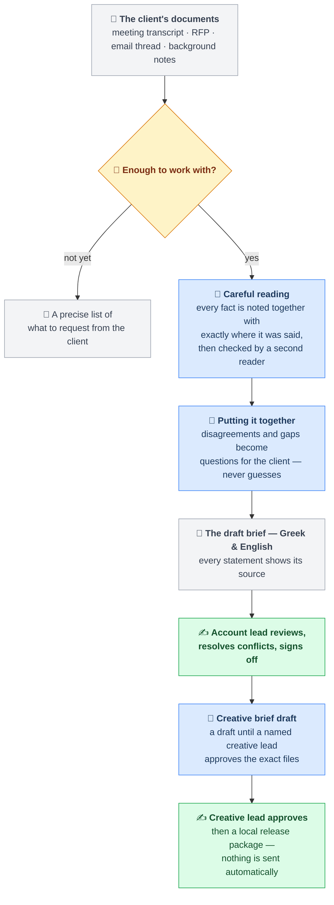

# Brief Builder

**From a messy pile of client inputs to a client-ready brief — in two languages, with receipts.**

> **Just cloned? Double-click [START_HERE.html](START_HERE.html)** (Finder/Explorer → it
> opens in your browser — no server, no install). It's the visual front door: a finished
> brief, the run view of how it was built, and the five-minute run guide, all offline from
> this repo. (GitHub shows the file as source; double-clicking your local copy renders it.)
>
> **Deciding on a pilot?** Read **[WALKTHROUGH.html](WALKTHROUGH.html)** — the decision
> paper: ten sheets, the graded run end to end, the numbers, the risks and the three
> decisions asked. **Looking for a document?** [docs/README.md](docs/README.md) lists every
> document with its status (current, frozen, historical) and a reading order per audience.

## About this project

Every project starts as a pile of inputs — a kickoff transcript, an RFP, an email thread. An
account lead spends hours turning it into *the brief*, and the same things always go wrong:
a number misremembered, a contradiction missed, a gap filled with a guess.

**Brief Builder** reads those documents and drafts the brief in **Greek and English**, with a
citation on every statement pointing to the exact line that supports it. Where sources
disagree, it shows both quotes and asks. Where something is missing, it writes the question
to send the client. Three rules run through everything:

- 🧾 **Every claim carries a receipt** — no citation, no claim.
- 🙋 **Gaps become questions, never guesses** — "around eighty" stays that way until the
  client says eighty *what*.
- ✍️ **People decide** — nothing moves past the draft without an account lead's sign-off,
  and no creative leaves the building without a named creative lead's approval.

Built as a working demo for a hiring case study (the PRD's case: a ~40-person PR/ad agency in
Athens). It runs end to end on realistic synthetic projects with deliberately seeded traps,
graded by a frozen harness against an answer key that the pipeline does not use: the key is
excluded from source discovery and is never passed to a runtime agent, by policy. It is not
cryptographically sealed or physically unreadable ([docs/EVIDENCE.md](docs/EVIDENCE.md) says
exactly what protects it).

### What is measured and what is assumed

| Claim | Status | Source |
|---|---|---|
| **17/17** frozen-harness checks on `northlight_01` | Measured, 2026-07-24, one synthetic project | [`runs/tier3/harness_report.json`](runs/tier3/harness_report.json) |
| **15/17**, then **16/17** after a synthesis re-roll, on the harder second fixture `voreas_02`; content-integrity failures the harness does not see are documented | Measured, 2026-07-26 | [`runs/voreas_prep_report.md`](runs/voreas_prep_report.md) · `runs/voreas-prep-02/`, `-03/` |
| **984 820 tokens** for one Stage-1 brief (Haiku 4.5 533 641 · Sonnet 5 451 179); 1 134 734 with the two-model creative A/B (Sonnet 5 86 441 · Opus 4.8 63 473) | Measured on the graded run, **Haiku-era routing** (extraction on Haiku) | `runs/tier3/run_manifest.json` · `python3 eval/cost_report.py runs/tier3 --tokens` |
| Whole-brief usage under the **current routing** (since 2026-07-30: extraction on Sonnet plus an independent `verify-extract` reader per source) | **Not yet measured.** The owner has authorised a live re-baseline (3 graded rolls each on `northlight_01` and `voreas_02`). The only measurement so far is one transcript extraction leg: 598 743 tokens against 295 774 on the graded run, from a local run that is not committed | [`docs/OPERATING_DECISIONS.md`](docs/OPERATING_DECISIONS.md) § 2026-09-22 |
| ~€38–40 of account-lead time per brief today | **Assumption**: PRD A1 (2 h) × A4 (€19–20/h), validated in pilot week 1 | `docs/PRD.md` §4 |
| Target: ~50 min of account-lead attention per brief, a saving of ~70 min | **Target**, PRD §2; the graded run's review was not timed | `docs/PRD.md` §2 |
| ~210 account-lead hours a year returned, ≈ €3 990–4 200 | **Arithmetic on assumptions**: (120 − 50) min × 180 briefs (A2) ÷ 60 × €19–20 (A4). PRD §10's "~€5–6k/yr" is not what its own assumptions give | `docs/PRD.md` §2, §4, §10 · WALKTHROUGH sheet 10 |
| 587 deterministic tests pass (7 skipped, 16 expected failures), frozen evidence 17/17, synthetic agency benchmark 12/12 | Measured at Tier 7; a **software rehearsal** — no model calls, not evidence of generative quality or time saved | [`runs/tier_7_report.md`](runs/tier_7_report.md) |

Usage is reported in tokens by model because the client is most likely to run on a
subscription, where the constraint is a usage window; whether the value claim is expressed as
subscription usage or API spend is an open owner decision
([`docs/pilot/OPERATING_TERMS.md`](docs/pilot/OPERATING_TERMS.md)). Dollars, for readers on
API terms, are a footnote.¹

Full artifact-backed proof — what ran, every check, every trap caught: **[docs/EVIDENCE.md](docs/EVIDENCE.md)**.

¹ On the developer-subscription substrate the graded run cost **$3.55** de-duplicated ($2.81
for Stage 1, including one extraction repair); the two clean Haiku-era Stage-1 runs cost
$2.07–2.44. These are Haiku-era figures and are not a price under the current routing.
[`docs/COST_MODEL.md`](docs/COST_MODEL.md) has the method.

## Where the project stands

- **Tiers 0–4** (July 2026) built and graded the two-stage pipeline: the evidence above.
- **Tiers 5–7** (September 2026) added the agency operating layer around it: evidence
  coverage and question triage, human resolution/attestation/approval bound to the exact
  revision, creative registration and **human-approved creative delivery** as a local package,
  package verification and withdrawal, clarification packs, and effort and rework recording.
  All of it is deterministic, fixture-only and test-covered; none of it sends anything.
- **Creative** is no longer shadow-only. Since the owner's decision of 2026-09-20 a creative
  draft can be released after sign-off and a named creative lead's approval of the exact
  files; the pilot includes creative delivery from week 1 under separation of duties
  (the approver is not the person who registered the draft or signed the brief).
  [`docs/OPERATING_DECISIONS.md`](docs/OPERATING_DECISIONS.md) records both decisions; the
  frozen PRD and the historical reports keep the older shadow-only wording as history.
- **Data**: synthetic fixtures only. Real client data needs the agency's data-policy approval.
- **Open**: the current-routing re-baseline, the pilot's commercial and data terms, and the
  sponsor's decisions on WALKTHROUGH sheet 10. The whole-project review loop and its scores
  live in [`tools/project_review/`](tools/project_review/).

## How it works


```mermaid
flowchart TB
    A["📂 <b>The client's documents</b><br/>meeting transcript · RFP · email thread · background notes"]
    B{"🚦 <b>Enough to work with?</b>"}
    B2["🙋 A precise list of<br/>what to request from the client"]
    C["🔎 <b>Careful reading</b><br/>every fact is noted together with<br/>exactly where it was said,<br/>then checked by a second reader"]
    D["🧩 <b>Putting it together</b><br/>disagreements and gaps become<br/>questions for the client — never guesses"]
    E["📄 <b>The draft brief — Greek & English</b><br/>every statement shows its source"]
    F["✍️ <b>Account lead reviews,<br/>resolves conflicts, signs off</b>"]
    G["🎨 <b>Creative brief draft</b><br/>a draft until a named creative lead<br/>approves the exact files"]
    H["✍️ <b>Creative lead approves</b><br/>then a local release package —<br/>nothing is sent automatically"]

    A --> B
    B -- "not yet" --> B2
    B -- "yes" --> C
    C --> D --> E --> F --> G --> H

    classDef ai fill:#dbeafe,stroke:#3b82f6,color:#1e3a5f
    classDef check fill:#fef3c7,stroke:#d97706,color:#7c2d12
    classDef human fill:#dcfce7,stroke:#16a34a,color:#14532d
    classDef doc fill:#f3f4f6,stroke:#9ca3af,color:#374151

    class A,B2,E doc
    class B check
    class C,D,G ai
    class F,H human
```

**The colors are the architecture:** 🟦 AI reads and drafts · 🟨 plain code checks ·
🟩 people decide. Every blue step is verified by an amber check — citations must resolve
word-for-word, protected brand terms must survive, no figure may appear that no source stated.
An output that fails is sent back once to fix; if it still fails, the system stops and says so.
**AI writes, code checks, humans decide.**

---

## For the technical reader

Two views of the same system. Both are true; they answer different questions.

### Product view (what the agency gets)

```
Brief/
├── Input/          ← drop the project's source files here (transcript, RFP, emails, background)
├── Output/         ← draft brief (EL + EN renders) + open questions + conflicts, per run
├── SOURCES.md      ← extraction rules per source type
├── SYNTHESIS.md    ← cross-source assembly & canonicalization rules
├── TRANSLATION.md  ← bilingual render rules
└── TRANSCRIPTS.md  ← transcript fidelity rules
```

A folder, an input, an output, and four instruction files: the skeleton is the product the
PRD describes. Tiers 5–7 put an agency operating layer around it (a set of `python3 -m
pipeline.<module>` commands for review, approval, delivery and coordination) without changing
the skeleton, the schema or the frozen gates.

### Build view (this repo — the factory and the exam)

| Path | Role | Ships? |
|---|---|---|
| `skills/*.md` (×4) | The four runtime instruction files — the product itself | Yes |
| `schema/` · `templates/` · `glossary/` | The contracts those files execute against | Yes |
| `config/` | Agency policy as data: readiness thresholds, channel spec table, per-stage effort and verifier routing, campaign profiles | Yes |
| `pipeline/` (Stage 1–2) | The deterministic core — runner, gates, extraction + verification, conflict pass, stages, creative gate, review pages and the `reviews/` shelf (`publish`) | Yes |
| `pipeline/` (Tiers 5–7) | Agency operations: `agency`, `agency_edit`, `quality`, `clarifications`, `client_pack`, `revisions`, `handover`, `spec_catalog`, `delivery`, `release_control`, `operations`, `question_exchange`, `effort` | Yes |
| `docs/pilot/` | Pilot operating pack: champion runbook, creative delivery, coordination, question exchange, effort recording, scorecard, operating terms | Yes |
| `fixtures/` (+ `answer_key.json`) | The exam: synthetic projects with seeded conflicts, gaps and garbling (`northlight_01`, `voreas_02`) plus three agency-benchmark fixtures | **No — test apparatus** |
| `eval/harness.py` | The grader — frozen after Tier 1; criteria fixed; the only code that reads the answer key² | **No — test apparatus** |
| `eval/` (rest) | Dev tooling: recurring violations, token/cost ruler, substrate spike, agency benchmark, pilot scorecard, rework report | No |
| `docs/` · `CLAUDE.md` | Build governance and the engineering record — index and status in [docs/README.md](docs/README.md) | No |
| `.claude/agents/` | Demo substrate (Claude Code subagents); production swaps in metered API calls — same skeleton | Depends |
| `tools/walkthrough/` · `tools/project_review/` | The decision paper's gate and history; the whole-project review loop | No |

Demo naming: `fixtures/northlight_01/` plays `Input/`; `runs/<timestamp>/` plays `Output/`.

² Precision matters here. The answer key has one commit in its history. The harness file has
two: the Tier-1 freeze (`9e371f6`) and a repo-relative path fallback (`7320689`, path plumbing
only, no acceptance criterion touched). One function the harness imports
(`gates.verify_citations`) changed once, at Tier 3 (`81e201c`), to fix a demonstrated false
positive — human-approved, documented in `runs/tier_3_report.md` §4, with fabrication detection
re-proven. The criteria and the answer key never moved.

### Run it

Requires Python ≥ 3.9 on macOS or Linux (the run locks use POSIX `fcntl`; Windows is not
supported).

```bash
python3 -m venv .venv && source .venv/bin/activate   # system pip is locked on modern macOS
python3 -m pip install -r requirements.txt           # jsonschema, pytest, PyYAML — nothing else
python3 -m pytest -q                                 # deterministic suite, no model calls, a few seconds
                                                     #   (Tier 7: 587 passed, 7 skipped, 16 xfailed)

# Model stages run as Claude Code subagents (install + authenticate the `claude` CLI).
# A Stage-1 run makes classify ×1, fidelity-check ×1 per transcript, extract + verify-extract
# per source, synthesize ×1 and render ×1: at least 12 model calls on northlight_01
# (4 sources, 1 transcript), more when a gate sends an output back for repair.
# Routing: .claude/agents/*.md frontmatter + config/model_routing.json. Usage under this
# routing is being re-baselined; the graded figures above are Haiku-era.
python3 pipeline/runner.py --project fixtures/northlight_01   # full run → runs/<ts>/
python3 eval/harness.py runs/latest                           # grade against the answer key
python3 eval/cost_report.py runs/<ts> --tokens                # where the tokens go, per stage
```

CI (`.github/workflows/quality.yml`) runs the deterministic suite, grades the committed
evidence 17/17 without rewriting it, and runs `python3 eval/agency_benchmark.py`.

**Live demo** — one document in, verified facts out (classify → extract → gates, no synthesis):
`python3 demo/run_demo.py fixtures/northlight_01/transcript_kickoff.md` (or pipe any ≤800-word
text via `-`). Prints the facts table with exact quotes, gate results, and the open questions
it creates instead of guessing. Haiku-era timing: [docs/demo_timing.md](docs/demo_timing.md).

No CLI or budget? The graded run is committed at **`runs/tier3/`** — signed brief, both
renders, all extracts, fidelity report, harness verdict (17/17), and the two Tier-4 creative
drafts (a sonnet/opus A/B produced in the then shadow-only mode). Every claim in the tier
reports is inspectable there without running anything.

### Two stages, one gate between them

Stage 1 (the client brief) is the default flow: readiness → classify → fidelity → extract
(+ independent verification per source) → conflict pass → synthesize → render. Stage 2 (the
creative brief) never runs automatically: a person must sign the brief off first (`python3 -m
pipeline.agency approve`, or the schema-validated manual edit the graded run used), then
`--stage creative`. `pipeline/creative.py` refuses an unsigned brief, and channel specs come
only from `config/channel_specs.json`, never generated. The draft it produces is a CREATIVE
DRAFT; it becomes deliverable only through the separate approval and release commands below.

### Agency operations (Tiers 5–7)

Start with the [brief champion runbook](docs/pilot/BRIEF_CHAMPION_RUNBOOK.md); the
[docs index](docs/README.md) lists the rest of the pilot pack. Every command is local,
fixture-only and explicit; none sends messages, posts content or approves on anyone's behalf.

- `python3 -m pipeline.agency --help` — evidence coverage audit, question triage, conflict
  resolution, bilingual attestation and approval bound to the exact revision; decision
  carry-forward across revisions (approvals never migrate).
- `python3 -m pipeline.agency_edit --help` — sourced checklist and deliverable entries.
- `python3 -m pipeline.spec_catalog --help` — bind a reviewed, dated traffic catalog (the
  shipped stub cannot pass release).
- `python3 -m pipeline.delivery --help` — register, approve and release selected creative
  ([creative delivery guide](docs/pilot/CREATIVE_DELIVERY.md)).
- `python3 -m pipeline.release_control --help` — verify a delivery package; record withdrawal.
- `python3 -m pipeline.operations RUN [OTHER_RUN ...]` — current blockers and next human
  actions across runs ([coordination guide](docs/pilot/COORDINATION.md)).
- `python3 -m pipeline.question_exchange --help` — version-bound clarification packs and
  revision impact ([question exchange](docs/pilot/QUESTION_EXCHANGE.md)).
- `python3 -m pipeline.effort --help` — record observed effort and handoff outcomes
  ([effort recording](docs/pilot/EFFORT_RECORDING.md)); `python3 -m eval.rework_report RUN ...`
  and `python3 eval/pilot_scorecard.py <scorecard.csv>` summarise them.
- `python3 eval/agency_benchmark.py` — synthetic fault-injection checks of these safeguards;
  no model calls, not evidence of generative quality.

The runner records input and configuration hashes for new runs: changed inputs refuse reuse
(create a new run ID), rerunning a leg archives invalidated outputs in `history/`, evidence
copies in `evidence/` are hash-verified, and shared run locks stop two operators mutating the
same run at once. Published review bundles carry project and content identifiers, so parallel
campaigns do not overwrite one another and existing shared links keep their revision.
