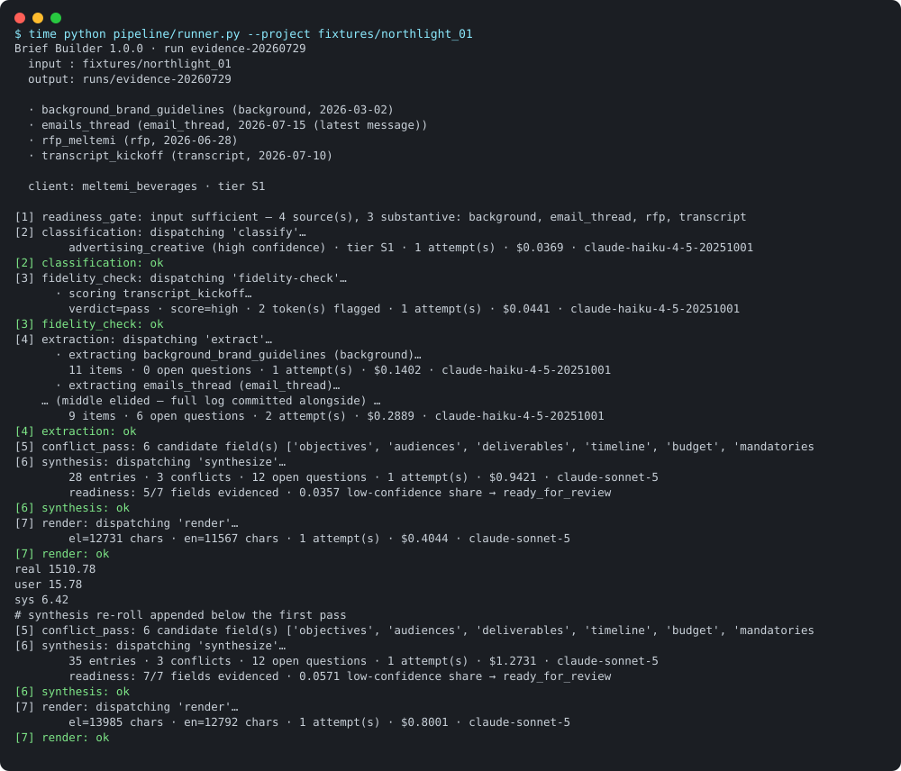
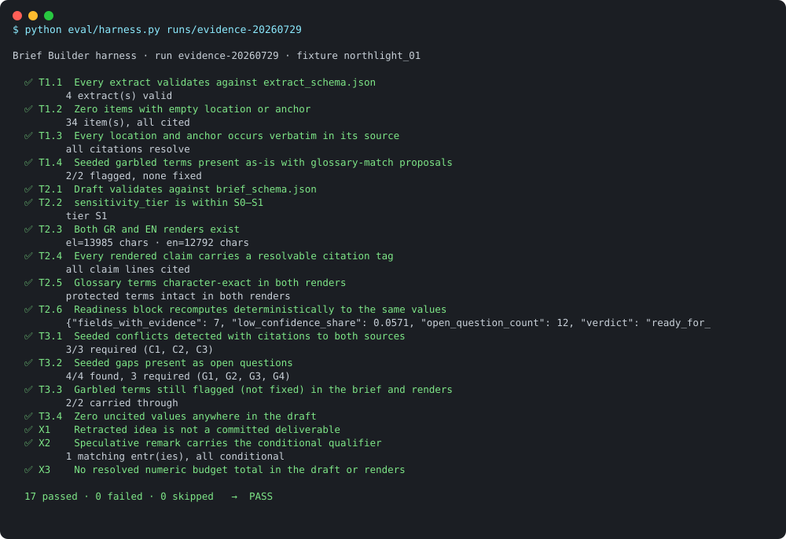
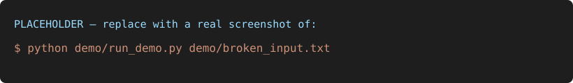

# Evidence pack — the graded tier-3 run

Everything on this page links to a committed artifact; nothing is asserted that a file
cannot back. The graded run lives in [`runs/tier3/`](../runs/tier3/).

## What ran, and when

| | |
|---|---|
| Fixture | `fixtures/northlight_01` — synthetic Greek/English agency project with a **sealed answer key** the pipeline structurally cannot read |
| Run | `runs/tier3`, completed 2026-07-24 (assembled across resumed legs; `run_manifest.json` records every step, with `from_earlier_run` marking carried steps) |
| Models (resolved IDs) | `claude-haiku-4-5-20251001` (classify, fidelity, extract) · `claude-sonnet-5` (synthesize, render) · `claude-opus-4-8` (creative A/B arm) |
| Verdict | **17/17 checks pass** — [`harness_report.json`](../runs/tier3/harness_report.json) |

Final deliverables, as generated: [Greek brief](../runs/tier3/brief_el.md) ·
[English brief](../runs/tier3/brief_en.md) · [canonical object](../runs/tier3/brief.json).
The original console output was not captured in 2026-07; the manifest is the durable
record. A fresh full-run console log (2026-07-27 re-run, labeled as such) is committed
alongside the timing numbers — see [`demo_timing.md`](demo_timing.md).

## The exam: 17 machine checks, every seeded trap caught

The harness (`eval/harness.py`, frozen) grades the run against the answer key. Tier 1
checks the evidence layer, tier 2 the brief and both renders, tier 3 the seeded challenges.

| # | Check | Result |
|---|---|---|
| T1.1 | Every extract validates against `extract_schema.json` | ✅ 4 extracts valid |
| T1.2 | Zero items with empty location or anchor | ✅ 33 items, all cited |
| T1.3 | Every location and anchor occurs **verbatim** in its source | ✅ all resolve |
| T1.4 | Seeded garbled terms present as-is with glossary proposals | ✅ 2/2 flagged, none "fixed" |
| T2.1 | Draft validates against `brief_schema.json` | ✅ |
| T2.2 | `sensitivity_tier` within the permitted S0–S1 | ✅ S1 |
| T2.3 | Both Greek and English renders exist | ✅ |
| T2.4 | Every rendered claim carries a resolvable citation tag | ✅ |
| T2.5 | Glossary terms character-exact in both renders | ✅ |
| T2.6 | Readiness block recomputes deterministically to the same values | ✅ |
| T3.1 | Seeded conflicts detected, both sides cited | ✅ 3/3 |
| T3.2 | Seeded gaps surfaced as open questions | ✅ 4/4 |
| T3.3 | Garbled terms still flagged (not fixed) in brief and renders | ✅ 2/2 |
| T3.4 | Zero uncited values anywhere in the draft | ✅ |
| X1 | Retracted idea is not a committed deliverable | ✅ |
| X2 | Speculative remark carries the `conditional` qualifier | ✅ |
| X3 | No resolved numeric budget total anywhere | ✅ |

### Trap → caught

| Seeded trap (in the fixture) | Where it was caught |
|---|---|
| «μπραντ αγουέρνες», «κι βίζουαλ» — ASR-garbled English terms in the transcript | Fidelity gate flagged both with glossary proposals ([report](../runs/tier3/fidelity/transcript_kickoff.report.json)); carried as-is through extract → brief → renders (T1.4, T3.3) — never silently corrected |
| €90k-incl-media (RFP) vs "ογδόντα, ίσως ογδόντα πέντε" excl. media (CFO) | Surfaced as an open conflict with both citations (T3.1 C1); **no merged or converted total anywhere** (X3) |
| RFP says October launch; a later email moves it to Sept 15 | Conflict with both citations, recency noted, resolution left to the human (T3.1 C2) |
| RFP audience 18–24 vs CMO's spoken correction to 25–40 | Conflict C3, both cited |
| OOH/metro idea proposed then retracted 19 seconds later | Absent from committed deliverables (X1) |
| "TikTok dance… don't hold me to it" | Carried with `qualifier: conditional` (X2) |
| No KPI, no media budget, no approver, no formats — anywhere | All four became client-facing open questions (T3.2) |

## Measured cost and timing

- **$2.25 per Stage-1 brief** (measured range $2.07–2.44 across runs) — method and
  breakdown in [`COST_MODEL.md`](COST_MODEL.md); reproduce with `python eval/cost_report.py`.
- The tier-3 manifest totals $4.29 because it additionally includes repair attempts and the
  two-model creative A/B arm.
- Stage timings summed over all attempts recorded in the tier-3 manifest:

| Stage | Time |
|---|---|
| classification | 34 s |
| transcript fidelity | 52 s |
| extraction (4 sources, incl. one repair) | 13.6 min |
| synthesis | 5.1 min |
| bilingual render | 9.2 min |
| creative shadow (A/B, 2 models) | 3.3 min |

Live single-document timing (10 measured runs, p50/p95): [`demo_timing.md`](demo_timing.md).

## Live-demo rehearsal (2026-07-29, fresh unseen sample)

A ~160-word synthetic kickoff snippet (new fictional client, never used in any fixture)
pasted into `demo_live/sources/live_transcript.md`, then both defense-session paths:

| Path | Command | Wall clock | Result |
|---|---|---|---|
| Extraction + verification only | `./demo.sh` | **205 s (3:25)** | 9 cited facts (speculation `conditional`, spoken figures kept in words), 9/9 citations verbatim, 4 open questions · $0.17 |
| Full pipeline, single source | `./run_full.sh` | **345 s (5:45)** | All stages first-attempt → both renders; run manifest records `demo_profile` and the production input gate's refusal (`refused_overridden_demo_profile`) — the override is logged, never silent · ~$0.64 |

## Screenshot moments (for the reviewer walk-through)

1. **Full pipeline completing with total wall-clock**
   `time python pipeline/runner.py --project fixtures/northlight_01`
   
2. **The frozen harness grading it 17/17**
   `python eval/harness.py runs/latest`
   
3. **The demo refusing to guess on a deliberately broken input** — garbled terms flagged
   as-is, vague budget becomes an open question, nothing invented
   `python demo/run_demo.py demo/broken_input.txt`
   

*(The `.svg` files are placeholders; replace each with a real screenshot of the same name
in PNG, updating the extension, when preparing the walk-through.)*
